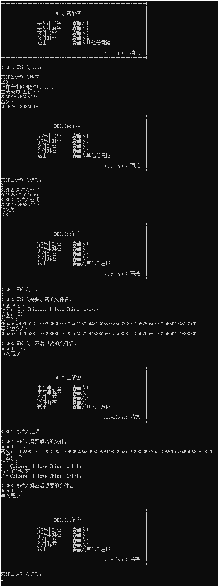
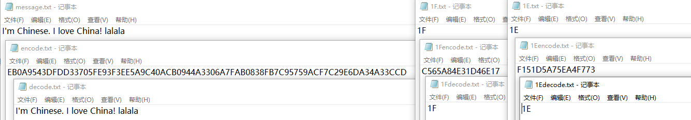

# DES算法的c++实现

## 功能如下

- [x] 字符串加密——请输入1
- [x] 字符串解密——请输入2
- [x] 文件加密——请输入3
- [x] 文件解密——请输入4
- [x] 退出——请输入其他任意键

## DES算法说明

### 1.整个过程

```
+----------------------------------------------------------------------+
|                                           
|                          64位输入                  
|                                                    
|                             ↓                      
|                                           
|                        初始变换(IP)
|
|                      ↓             ↓ 
|                     
|                 L0(32bit)          R0(32bit) 
|
|                      ↓             ↓ 
|                     
|           L1(32bit)=R0(32bit)   R1(32bit)=L0⊕f(R0,k1)
|
|                      ↓             ↓ 
|                     
|           L2(32bit)=R1(32bit)   R2(32bit)=L1⊕f(R1,k2)
|
|                      ↓             ↓ 
|                     
|                      ……             ……
|
|                      ↓             ↓ 
|                     
|      Li(32bit)=R(i-1)(32bit)    Ri(32bit)=L(i-1)⊕f(R(i-1),ki)
|
|                      ↓             ↓ 
|                     
|                      ……             ……
|
|                      ↓             ↓ 
|                     
|          L16(32bit)=R15(32bit) R16(32bit)=L15⊕f(R15,k16)
|
|                      ↓             ↓ 
|                     
|                     逆初始变换(IP^(-1))
|                                           
|                             ↓                      
|                                           
|                          64位输出
+----------------------------------------------------------------------+
```

### 2.f函数

```
+----------------------------------------------------------------------+
|                                           
|                                           
|     L(i-1)                R(i-1)                 key(48bit)
|                                                      
|      |  ┌------------------ ↓                        |
|      |  |                                            |
|      |  |        拓展置换(32bit->48bit)               |
|      |  |                                            |
|      |  |                   ↓                        |
|      |  |                                            |
|      |  |                   ⊕ ←---------------------┘
|      |  |     
|      |  |                   ↓ 
|      |  |             
|      |  |            s-盒(48bit->32bit) 
|      |  |
|      |  |                   ↓ 
|      |  |             
|      |  |                 p-盒
|      |  |
|      |  |                   ↓ 
|      |  |             
|      ┕--------------------→ ⊕
|         | 
|         ↓                   ↓ 
|                     
|         Li                  Ri
|                                           
|                     
+----------------------------------------------------------------------+
```

### 3.子密钥产生过程

```
+----------------------------------------------------------------------+
|                                           
|                                           
|             K(64bit)   
|                                                      
|                ↓            
|  
|      置换选择1(64bit->56bit)    
|                              
|         ↓                ↓     
|   
|        C0       +       D0
|                              
|         ↓                ↓     
|   
|        LS               LS
|                              
|         ↓                ↓     
|   
|        C1       +       D1 -→ 置换选择2(56bit->48bit) -→ k1(48bit)  
|                              
|         ↓                ↓     
|   
|        LS               LS
|                              
|         ↓                ↓     
|                              
|        ……               ……                ……
|                              
|         ↓                ↓     
|   
|        LS               LS
|                              
|         ↓                ↓     
|   
|        C16      +      D16 -→ 置换选择2(56bit->48bit) -→ k16(48bit)  
|                     
+----------------------------------------------------------------------+
```

### 4.算法详细说明

[参考百度百科](https://baike.baidu.com/item/des%E7%AE%97%E6%B3%95/10306073)

DES算法把64位的明文输入块变为64位的密文输出块，它所使用的密钥也是64位，整个算法的主流程图如下：


**置换规则表**

其功能是把输入的64位数据块按位重新组合，并把输出分为L0、R0两部分，每部分各长32位，其置换规则见下表：
```
58,50,42,34,26,18,10,2,60,52,44,36,28,20,12,4,
62,54,46,38,30,22,14,6,64,56,48,40,32,24,16,8,
57,49,41,33,25,17,9,1,59,51,43,35,27,19,11,3,
61,53,45,37,29,21,13,5,63,55,47,39,31,23,15,7
```

即将输入的第58位换到第一位，第50位换到第2位，...，依此类推，最后一位是原来的第7位。L0、R0则是换位输出后的两部分，L0是输出的左32位，R0 是右32位，例：设置换前的输入值为D1D2D3......D64，则经过初始置换后的结果为：L0=D58D50...D8；R0=D57D49...D7。

**逆置换规则表**

经过16次迭代运算后。得到L16、R16，将此作为输入，进行逆置换，即得到密文输出。逆置换正好是初始置换的逆运算。例如，第1位经过初始置换后，处于第40位，而通过逆置换，又将第40位换回到第1位，其逆置换规则如下表所示：
```
40,8,48,16,56,24,64,32,39,7,47,15,55,23,63,31,
38,6,46,14,54,22,62,30,37,5,45,13,53,21,61,29,
36,4,44,12,52,20,60,28,35,3,43,11,51,19,59,27,
34,2,42,10,50,18,58 26,33,1,41,9,49,17,57,25
```


**放大换位表(e盒32bit->48bit)**

```
32,1,2,3,4,5,4,5,6,7,8,9,8,9,10,11,
12,13,12,13,14,15,16,17,16,17,18,19,20,21,20,21,
22,23,24,25,24,25,26,27,28,29,28,29,30,31,32,1,
```

**功能表(e盒48bit->32bit)**

在`f(Ri,Ki）`算法描述图中，S1,S2...S8为选择函数，其功能是把48bit数据变为32bit数据。下面给出选择函数Si(i=1,2......8）的功能表：

```
选择函数Si
S1:
14,4,13,1,2,15,11,8,3,10,6,12,5,9,0,7,
0,15,7,4,14,2,13,1,10,6,12,11,9,5,3,8,
4,1,14,8,13,6,2,11,15,12,9,7,3,10,5,0,
15,12,8,2,4,9,1,7,5,11,3,14,10,0,6,13,
S2:
15,1,8,14,6,11,3,4,9,7,2,13,12,0,5,10,
3,13,4,7,15,2,8,14,12,0,1,10,6,9,11,5,
0,14,7,11,10,4,13,1,5,8,12,6,9,3,2,15,
13,8,10,1,3,15,4,2,11,6,7,12,0,5,14,9,
S3:
10,0,9,14,6,3,15,5,1,13,12,7,11,4,2,8,
13,7,0,9,3,4,6,10,2,8,5,14,12,11,15,1,
13,6,4,9,8,15,3,0,11,1,2,12,5,10,14,7,
1,10,13,0,6,9,8,7,4,15,14,3,11,5,2,12,
S4:
7,13,14,3,0,6,9,10,1,2,8,5,11,12,4,15,
13,8,11,5,6,15,0,3,4,7,2,12,1,10,14,9,
10,6,9,0,12,11,7,13,15,1,3,14,5,2,8,4,
3,15,0,6,10,1,13,8,9,4,5,11,12,7,2,14,
S5:
2,12,4,1,7,10,11,6,8,5,3,15,13,0,14,9,
14,11,2,12,4,7,13,1,5,0,15,10,3,9,8,6,
4,2,1,11,10,13,7,8,15,9,12,5,6,3,0,14,
11,8,12,7,1,14,2,13,6,15,0,9,10,4,5,3,
S6:
12,1,10,15,9,2,6,8,0,13,3,4,14,7,5,11,
10,15,4,2,7,12,9,5,6,1,13,14,0,11,3,8,
9,14,15,5,2,8,12,3,7,0,4,10,1,13,11,6,
4,3,2,12,9,5,15,10,11,14,1,7,6,0,8,13,
S7:
4,11,2,14,15,0,8,13,3,12,9,7,5,10,6,1,
13,0,11,7,4,9,1,10,14,3,5,12,2,15,8,6,
1,4,11,13,12,3,7,14,10,15,6,8,0,5,9,2,
6,11,13,8,1,4,10,7,9,5,0,15,14,2,3,12,
S8:
13,2,8,4,6,15,11,1,10,9,3,14,5,0,12,7,
1,15,13,8,10,3,7,4,12,5,6,11,0,14,9,2,
7,11,4,1,9,12,14,2,0,6,10,13,15,3,5,8,
2,1,14,7,4,10,8,13,15,12,9,0,3,5,6,11,
```

在此以S1为例说明其功能，我们可以看到：在S1中，共有4行数据，命名为0，1、2、3行；每行有16列，命名为0、1、2、3，......，14、15列。

现设输入为：D=D1D2D3D4D5D6

令：行=D1D6，列=D2D3D4D5

然后在S1表中查得对应的数，以4位二进制表示，此即为选择函数S1的输出。

**单纯换位表(p盒)**

```
16,7,20,21,29,12,28,17,1,15,23,26,5,18,31,10,
2,8,24,14,32,27,3,9,19,13,30,6,22,11,4,25,
```

**子密钥的算法**

下面给出子密钥Ki（48bit）的生成算法


从子密钥Ki的生成算法描述图中我们可以看到：初始Key值为64位，但DES算法规定，其中第8、16、......64位是奇偶校验位，不参与DES运算。故Key 实际可用位数便只有56位。即：经过缩小选择换位表1的变换后，Key 的位数由64 位变成了56位，此56位分为C0、D0两部分，各28位，然后分别进行第1次循环左移，得到C1、D1，将C1（28位）、D1（28位）合并得到56位，再经过缩小选择换位2，从而便得到了密钥K0（48位）。依此类推，便可得到K1、K2、......、K15，不过需要注意的是，16次循环左移对应的左移位数要依据下述规则进行：

**循环左移位数**

```
1,1,2,2,2,2,2,2,1,2,2,2,2,2,2,1
```

以上介绍了DES算法的加密过程。DES算法的解密过程是一样的，区别仅仅在于第一次迭代时用子密钥K15，第二次K14、......，最后一次用K0，算法本身并没有任何变化。


## 编程说明

看代码吧(*/ω＼*)，暂时太懒了... 我一定补回来。

注意：读写文件在txt文件夹中

好像[main.cpp](main.cpp)汉字会乱码，源代码存到[main.txt](main.txt)里了

## 运行截图

### terminal



### txt

