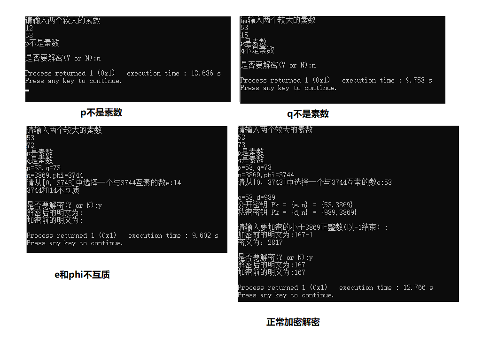

# RSA算法的c++实现

## 算法简介

（1）公钥

选择两个互异大质数p,q,使 `n=pq` , `phi(n)=(p-1)(q-1)` ,phi(n)是欧拉函数，选择一个正整数额，使其满足与phi互质，将 `Kp={e,n}` 称作公钥。

（2）私钥

求出正数d使其满足 `ed=1 mod phi` ，将 `Kp={d,n}` 称作私钥。

（3）加密变换

明文M已知，密文C，`C=M^e mod n`

（4）解密变换

密文C已知，明文M，`M=C^d mod n`

## 代码实现

### 质数判断

```c
  #include <stdio.h>
  int main()
  {
      int i,n;
      scanf("%d",&n);
      for(i=2;i*i<=n;i++)
          if(n%i==0)break;
      printf("%s\n",n%i==0?"No":"Yes");
      return 0;
  }
```

### 互质判断

```c
  int gcd(int x,int y)
  {
      int t;
      while (y) t=x, x=y, y=t%y;
      return x; // 最小公因数
  }
```

好像[main.cpp](main.cpp)汉字会乱码，源代码存到[main.txt](main.txt)里了

## 效果截图

